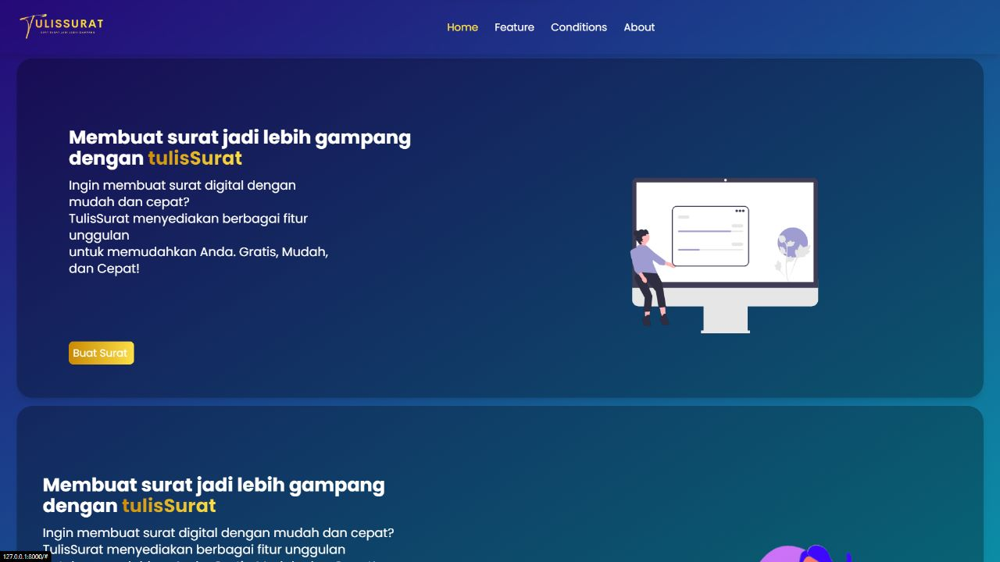

<h1>TULIS SURAT</h1><br>
<h2>NAMA DEVELOPER:<br>
1. KHAIRIL ILMI (2108107010011)<br>
2. RiDHO FERDIANSYAH (2108107010039)</h2>
<br>
<h3>Path yang didownload di : Documents/PBW/Surat</h3>
<br>
<a href="https://github.com/KhairilIlmi16/tulisSuratPBWRI/tree/main/Documents/PBW/Surat"><b>Di Sini</b></a><br>
Tulis Surat adalah sebuah platform inovatif yang dirancang untuk memudahkan pengguna dalam membuat surat secara cepat dan efisien. Website ini menyediakan layanan yang memungkinkan pengguna untuk menghasilkan surat dengan hanya memasukkan data-data penting, tanpa harus repot mengisi konten surat secara manual.<br>
<br>
Dengan menggunakan Tulis Surat, pengguna dapat dengan mudah menghasilkan surat-surat seperti surat pengunduran diri, surat permohonan, surat penawaran, surat pemberitahuan, dan berbagai jenis surat lainnya. Pengguna hanya perlu memasukkan informasi yang diperlukan, seperti nama pengirim, alamat, tanggal, nama penerima, dan tujuan surat. Setelah data tersebut diisi, sistem akan secara otomatis menghasilkan surat lengkap dengan format dan tata bahasa yang sesuai.

Kelebihan utama dari Tulis Surat adalah kemudahan dan kecepatan dalam menghasilkan surat. Dengan menggunakan platform ini, pengguna tidak perlu repot-repot menyusun surat dari awal atau mencari contoh surat di internet. Pengguna juga tidak perlu khawatir tentang tata bahasa dan format yang benar, karena Tulis Surat telah didesain untuk menghasilkan surat yang profesional dan sesuai dengan standar yang berlaku.

Selain itu, Tulis Surat juga menyediakan beberapa opsi template surat yang dapat dipilih pengguna sesuai dengan jenis surat yang ingin dibuat. Pengguna dapat memilih dari berbagai format yang telah disediakan, termasuk format resmi, bisnis, atau pribadi, sehingga surat yang dihasilkan dapat disesuaikan dengan kebutuhan dan gaya komunikasi yang diinginkan.

Tulis Surat juga memiliki fitur pengeditan yang memungkinkan pengguna untuk memeriksa dan mengubah isi surat jika diperlukan sebelum mengunduhnya. Pengguna dapat memeriksa kesalahan atau menambahkan konten tambahan sebelum menghasilkan surat akhir.

Dengan menggunakan Tulis Surat, pengguna dapat menghemat waktu dan upaya yang diperlukan untuk membuat surat secara manual. Platform ini cocok digunakan oleh individu, profesional, atau perusahaan yang sering menghasilkan surat-surat resmi dalam rutinitas sehari-hari.
aplikasi tulis surat generator
Di sini perlu install 

```bash
composer require phpoffice/phpword
```


<p align="center"><a href="https://laravel.com" target="_blank"></a></p>

<p align="center">
<a href="https://github.com/laravel/framework/actions"></a>
<a href="https://packagist.org/packages/laravel/framework"></a>
<a href="https://packagist.org/packages/laravel/framework"></a>
<a href="https://packagist.org/packages/laravel/framework"></a>
</p>

## About Laravel

Laravel is a web application framework with expressive, elegant syntax. We believe development must be an enjoyable and creative experience to be truly fulfilling. Laravel takes the pain out of development by easing common tasks used in many web projects, such as:

- [Simple, fast routing engine](https://laravel.com/docs/routing).
- [Powerful dependency injection container](https://laravel.com/docs/container).
- Multiple back-ends for [session](https://laravel.com/docs/session) and [cache](https://laravel.com/docs/cache) storage.
- Expressive, intuitive [database ORM](https://laravel.com/docs/eloquent).
- Database agnostic [schema migrations](https://laravel.com/docs/migrations).
- [Robust background job processing](https://laravel.com/docs/queues).
- [Real-time event broadcasting](https://laravel.com/docs/broadcasting).

Laravel is accessible, powerful, and provides tools required for large, robust applications.

## Learning Laravel

Laravel has the most extensive and thorough [documentation](https://laravel.com/docs) and video tutorial library of all modern web application frameworks, making it a breeze to get started with the framework.

You may also try the [Laravel Bootcamp](https://bootcamp.laravel.com), where you will be guided through building a modern Laravel application from scratch.

If you don't feel like reading, [Laracasts](https://laracasts.com) can help. Laracasts contains over 2000 video tutorials on a range of topics including Laravel, modern PHP, unit testing, and JavaScript. Boost your skills by digging into our comprehensive video library.

## Laravel Sponsors

We would like to extend our thanks to the following sponsors for funding Laravel development. If you are interested in becoming a sponsor, please visit the Laravel [Patreon page](https://patreon.com/taylorotwell).

### Premium Partners

- **[Vehikl](https://vehikl.com/)**
- **[Tighten Co.](https://tighten.co)**
- **[Kirschbaum Development Group](https://kirschbaumdevelopment.com)**
- **[64 Robots](https://64robots.com)**
- **[Cubet Techno Labs](https://cubettech.com)**
- **[Cyber-Duck](https://cyber-duck.co.uk)**
- **[Many](https://www.many.co.uk)**
- **[Webdock, Fast VPS Hosting](https://www.webdock.io/en)**
- **[DevSquad](https://devsquad.com)**
- **[Curotec](https://www.curotec.com/services/technologies/laravel/)**
- **[OP.GG](https://op.gg)**
- **[WebReinvent](https://webreinvent.com/?utm_source=laravel&utm_medium=github&utm_campaign=patreon-sponsors)**
- **[Lendio](https://lendio.com)**

## Contributing

Thank you for considering contributing to the Laravel framework! The contribution guide can be found in the [Laravel documentation](https://laravel.com/docs/contributions).

## Code of Conduct

In order to ensure that the Laravel community is welcoming to all, please review and abide by the [Code of Conduct](https://laravel.com/docs/contributions#code-of-conduct).

## Security Vulnerabilities

If you discover a security vulnerability within Laravel, please send an e-mail to Taylor Otwell via [taylor@laravel.com](mailto:taylor@laravel.com). All security vulnerabilities will be promptly addressed.

## License

The Laravel framework is open-sourced software licensed under the [MIT license](https://opensource.org/licenses/MIT).
# TulisSuratWebsite
